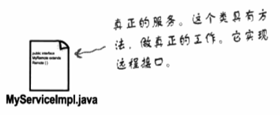
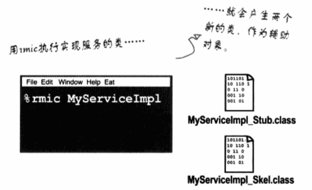
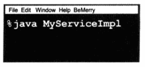
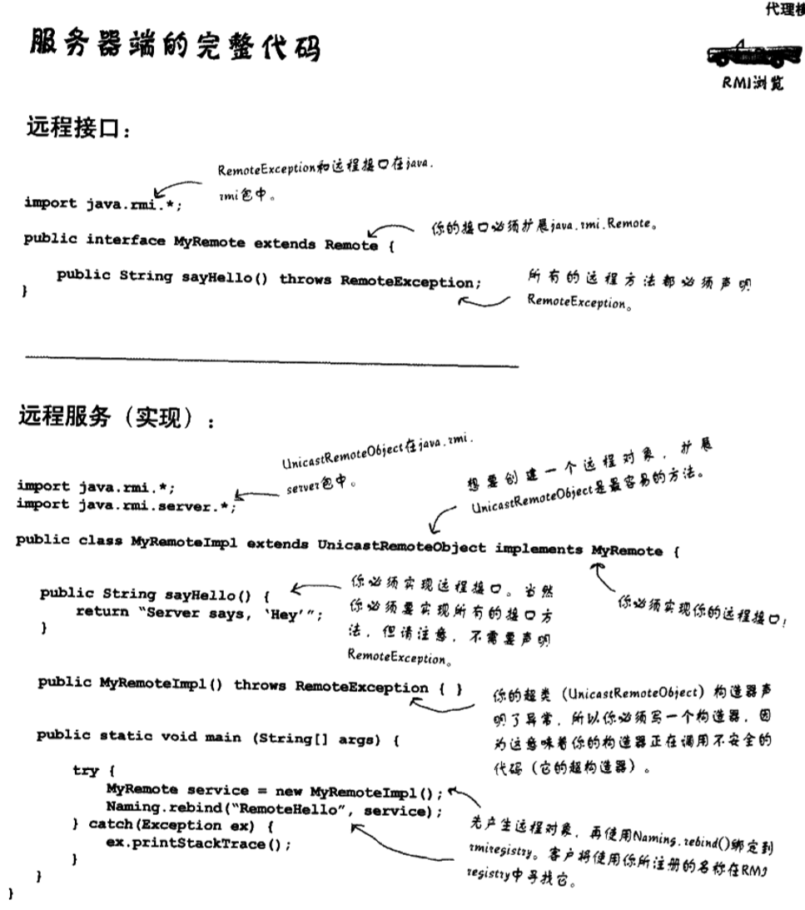
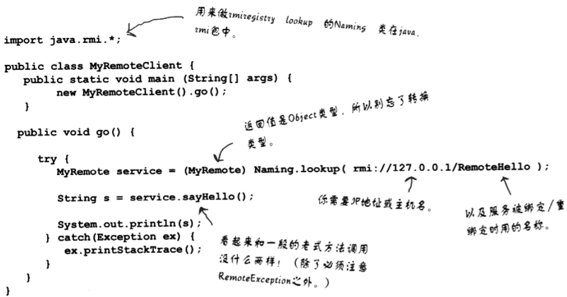

RMI
---

<!-- TOC -->

- [1. RMI概述](#1-rmi概述)
  - [1.1. RMI依赖的包](#11-rmi依赖的包)
  - [1.2. RMI概念](#12-rmi概念)
  - [1.3. 制作远程服务](#13-制作远程服务)
    - [1.3.1. 第一步：制作远程接口](#131-第一步制作远程接口)
    - [1.3.2. 第二步：制作远程的实现](#132-第二步制作远程的实现)
    - [1.3.3. 第三步：利用rmic产生的stub和skeleton](#133-第三步利用rmic产生的stub和skeleton)
    - [1.3.4. 第四步：启动RMI registry](#134-第四步启动rmi-registry)
    - [1.3.5. 第五步：开始远程服务](#135-第五步开始远程服务)
  - [1.4. 服务器端的完整实现](#14-服务器端的完整实现)
    - [1.4.1. 用户如何取得stub对象](#141-用户如何取得stub对象)
    - [1.4.2. RMI的运行方式](#142-rmi的运行方式)
  - [1.5. 完整的客户代码](#15-完整的客户代码)
  - [1.6. 关于RMI的一些注意](#16-关于rmi的一些注意)

<!-- /TOC -->

# 1. RMI概述
1. RMI提供了客户辅助对象和服务辅助对象，为客户辅助对象创建和服务对象相同的方法。
2. RMI保证客户可以直接访问远程JVM中的方法，而不用管更多的技术细节。
3. RMI提供了所有运行时的基础设施，其内容包括查找服务等。
4. 在这样的情况下,我们需要充分认识到网络和I/O是有风险的，容易失败的。

## 1.1. RMI依赖的包
```java
import java.rmi.*;
import java.rmi.server.*;
```

## 1.2. RMI概念


1. 客户辅助对象:stub
2. 服务辅助对象:skeleton

## 1.3. 制作远程服务
制作远程服务的五个步骤如下

### 1.3.1. 第一步：制作远程接口


1. 定义了可以让用户远程调用的方法，客户将用它作为服务的类类型，stub和实际的服务都是实现此接口。
2. 扩展java.rmi.Remote:
    1. remote接口是一个"记号"接口，不具备方法。这里的扩展是指一个接口继承另一个接口。
3. 声明所有的方法都会抛出RemoteException
    1. 用户调用远程接口服务，需要注意在stub低层我们使用了网络和I/O,所以一切网络可能发生的事情都会发生。
    2. 客户必须意识到风险，通过处理或声明远程异常来解决。也就是方法应当声明成`public string sayHello() throws RemoteException`
4. 确定变量和返回值是属于原语(primitive)类型或者可序列化(Serializable)类型。
    + 远程方法的变量必须被打包并通过网络运送，这要靠序列化来完成。
    + 所以会有以下两种情况:
      1. 你使用原语类型、字符串和许多API中内定的类型。
      2. 如果是自己的类，需要确定你实现了Serizable.

### 1.3.2. 第二步：制作远程的实现


1. 这是做实际工作的类，为远程接口中定义的远程方法提供了真正的实现。
2. 实现远程接口:也就是客户将要调用的方法的接口。`implements MyRemote()`
3. 扩展`UnicastRemoteObject`
    - 为了要成为远程服务对象，你的对象需要某些"远程的"功能，最基本的就是扩展`java.rmi.server.UnicastRemoteObject`,让超类来帮助你工作。
4. 设计一个不带变量的构造器，并声明`RemoteException`
    + 新超类`UnicastRemoteObject`带来问题:抛出`RemoteException`。
    + 解决方案:就是你的远程实现声明一个构造器，这样就有一个声明`RemoteException`的地方，这样类被实例化的时候，如果超类的构造器抛出异常，其子类构造器必然会抛出异常。
5. 使用`RMI Registry`注册此服务
    + 你已经准备好远程服务了那么你需要让它可以被远程客户调用。
    + 需要做的:将这个服务实例化，然后放进`RMI registry`中。注册服务用的是`java.rmi.Naming`类的静态`rebind()`类。

```java
try{
    MyRemote service = new MyRemote();
    Naming.rebind("RemoteHello",service);
}catch (Exception ex){}
```

### 1.3.3. 第三步：利用rmic产生的stub和skeleton



1. 运行rmic的时候帮助你生成相应的辅助对象。
2. 在远程实现类上执行rmic(注意不是远程接口)
    + rmic是JDK内的一个工具，用来为一个服务类产生stub和skleton，相应命名习惯是在远程实现的名字后面加上_Stub或_Skel，rmic有一些选项可以调整。
    + 需要注意package等的包路径问题，并且保证rmic的文件目录和目标class是同级目录。

### 1.3.4. 第四步：启动RMI registry


1. 用户可以用来查询代理的位置
2. 开启一个终端启动rmiregistry
    + 同样要保证启动目录必须可以访问你的类。

### 1.3.5. 第五步：开始远程服务



1. 必须让服务对象开始运行，你的服务实现类会去实例化一个服务的实例，并将这个服务注册到RMI registry中去，这个服务就可以被调用了。
2. 可能从main里面启动，也可能是从一个独立的启动类中启动

## 1.4. 服务器端的完整实现



### 1.4.1. 用户如何取得stub对象
1. 用户必须取得stub对象(我们的代理)以调用其中的方法。所以我们需要RMI registry的帮忙(lookup)
    + `MyRemote service = (MyRemote) Naming.lookup("rmi://127.0.0.1/RemoteHello")`
    + 这是包内的一个静态方法，它从参数中得知位置和服务名称，然后在该位置的rmiregistry中寻找该名称的服务。

### 1.4.2. RMI的运行方式
1. 客户到RMI registry中寻找:`Naming.lookup("rmi://127.0.0.1/RemoteHello")`
2. RMI registry返回Stub对象:然后RMI自动对返回值进行反序列化，选址是在客户端必须有stub类，否则无法进行反序列化。
3. 客户调用stub的方法，就像stub是真正的对象以一样。

## 1.5. 完整的客户代码



1. 在对于远端JVM池中的方法的调用，在看起来和本地没有什么区别，但是需要注意RemoteException。
2. 客户如何取得stub类:(一共有两种方法)
    1. 使用lookup找到被挂载的现成的stub类。即可
    2. 通过"动态类下载"，通过上述操作，序列化的对象可以被标记上一个URL，告诉客户的RMI系统去寻找对象的类文件。而如果在反序列化对象的过程中，如果RMI没有在本地发现类，就会利用HTTP的GET从该URL取得类文件。

## 1.6. 关于RMI的一些注意
1. 忘记在启动远程服务之前先启动rmiregistry(要用Naming。rebind()注册服务，并且保证其运行状态。)
2. 忘记让变量和返回值的类型成为可序列化的类型(这种错误无法在编译器发现，只会在运行时发现)。
3. 忘记给客户提供stub类。
4. 在远程接口中要支持的方法都要抛出RemoteException异常。