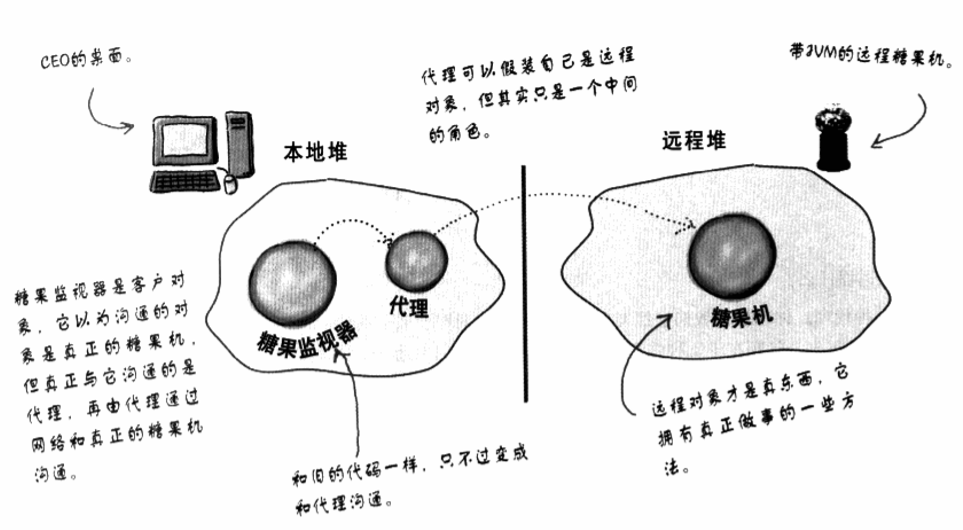
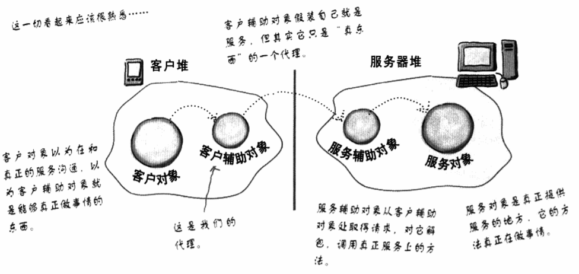
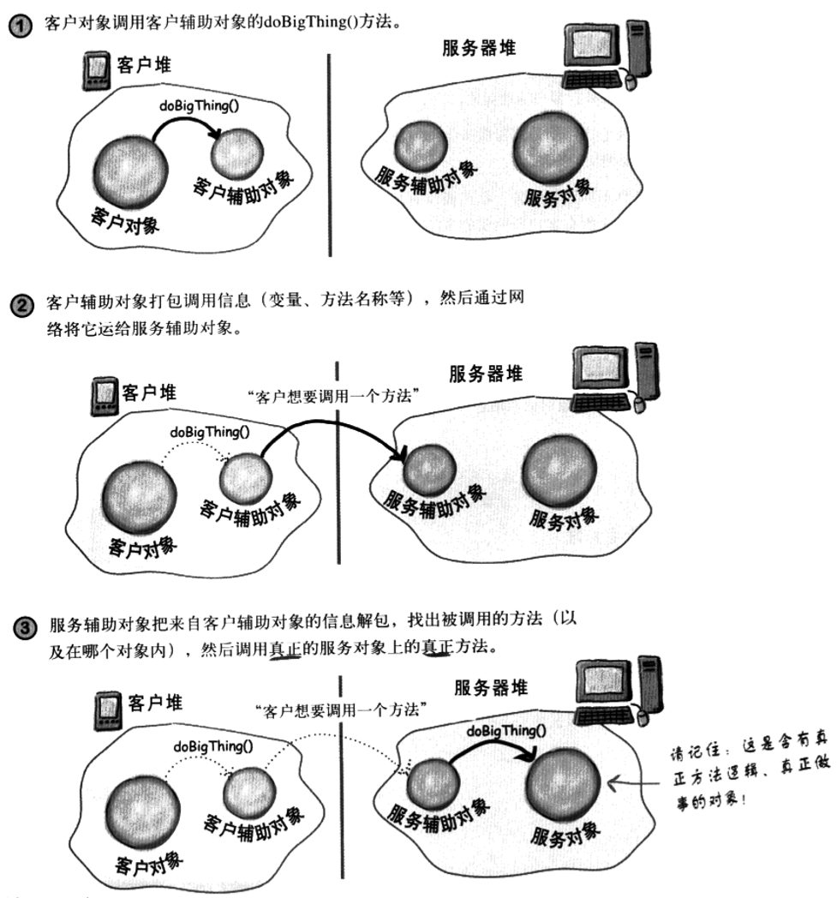
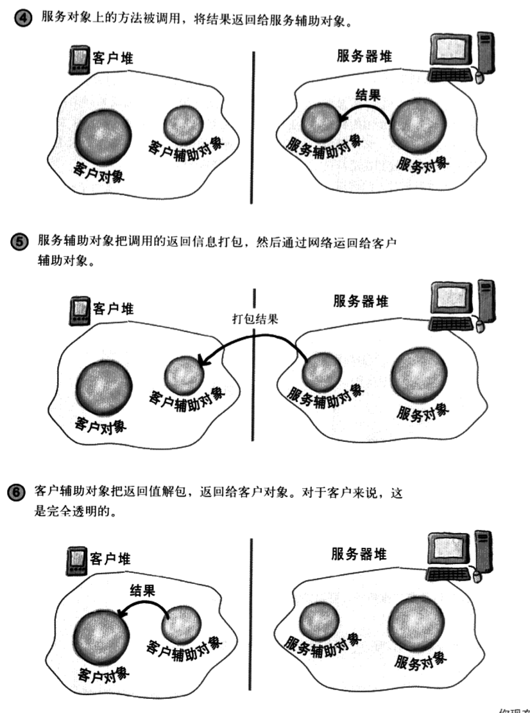

代理模式
---
1. 控制对象访问，控制和管理访问。
2.  那么代理是什么?代理就是我们某个真实的对象。远程对象是一种对象，活在不同的JVM堆中。

<!-- TOC -->

- [1. 远程代理](#1-远程代理)
  - [1.1. 远程方法](#11-远程方法)
  - [1.2. 远程JVM对象和本地JVM对象的交互过程](#12-远程jvm对象和本地jvm对象的交互过程)
  - [1.3. 问题:如何访问另一个堆里的对象](#13-问题如何访问另一个堆里的对象)
- [2. 使用RMI来解决糖果机问题](#2-使用rmi来解决糖果机问题)
  - [2.1. 序列化State类](#21-序列化state类)
  - [2.2. 实现糖果机代码](#22-实现糖果机代码)
  - [2.3. 将相应部分进行注册](#23-将相应部分进行注册)
  - [2.4. 实现糖果控制机(客户端)](#24-实现糖果控制机客户端)
  - [2.5. 操作过程](#25-操作过程)
- [3. 代理模式](#3-代理模式)
  - [3.1. 代理模式的定义](#31-代理模式的定义)
  - [3.2. 解决的问题](#32-解决的问题)
  - [3.3. 代理模式的类图](#33-代理模式的类图)
  - [3.4. 优点](#34-优点)
  - [3.5. 缺点](#35-缺点)
- [4. 代理模式应用](#4-代理模式应用)
- [5. 代理模式使用场景](#5-代理模式使用场景)
  - [5.1. 虚拟代理](#51-虚拟代理)
    - [5.1.1. 虚拟代理的例子:显示CD封面](#511-虚拟代理的例子显示cd封面)
    - [5.1.2. 虚拟代理的类图](#512-虚拟代理的类图)
    - [5.1.3. ImageProxy工作方式](#513-imageproxy工作方式)
    - [5.1.4. ImageProxy的实现](#514-imageproxy的实现)
    - [5.1.5. 我们实现的是什么？](#515-我们实现的是什么)
    - [5.1.6. 虚拟代理的一些问题](#516-虚拟代理的一些问题)
  - [5.2. 保护代理](#52-保护代理)
    - [5.2.1. 动态代理的类图](#521-动态代理的类图)
    - [5.2.2. 例子：存储一个人的个人信息](#522-例子存储一个人的个人信息)
    - [5.2.3. 第一步:创建InvocationHandler](#523-第一步创建invocationhandler)
    - [5.2.4. 第二步:创建Proxy类并实例化Proxy对象](#524-第二步创建proxy类并实例化proxy对象)
    - [5.2.5. 动态代理的部分问题](#525-动态代理的部分问题)
  - [5.3. 很多其他形式的代理](#53-很多其他形式的代理)
    - [5.3.1. 防火墙代理](#531-防火墙代理)
    - [5.3.2. 智能引用代理](#532-智能引用代理)
    - [5.3.3. 缓存代理](#533-缓存代理)
    - [5.3.4. 同步代理](#534-同步代理)
    - [5.3.5. 复杂隐藏代理(外观代理)](#535-复杂隐藏代理外观代理)
    - [5.3.6. 写入时复制代理](#536-写入时复制代理)
  - [5.4. 简单的代码示例](#54-简单的代码示例)
    - [5.4.1. 类图](#541-类图)
    - [5.4.2. 代码实现](#542-代码实现)

<!-- /TOC -->

# 1. 远程代理



1. 你的客户对象做的就像是在做远程方法调用，但其实只是调用本地堆中的"代理"对象上的方法，再由代理处理所有网络通信的低层细节。

## 1.1. 远程方法
1. 我们需要使用辅助对象来帮助我们进行真正的沟通。
2. 在服务器端，服务辅助对象从客户辅助对象中接受要求(透过Socket连接)，将调用的信息解包，然后调用真正服务对象上的相应实方法。
3. 服务辅助对象从服务中得到相应的返回值，将它打包，然后返回到客户辅助对象(通过网络Socket的输出流)，客户辅助对象对信息解包，最后将返回值交给客户对象。



## 1.2. 远程JVM对象和本地JVM对象的交互过程
- 本地 -> 远程



- 远程 -> 本地



## 1.3. 问题:如何访问另一个堆里的对象
1. 我们可以使用RMI来找到远程JVM内的对象，并允许我们调用它们的方法。

# 2. 使用RMI来解决糖果机问题

## 2.1. 序列化State类


1. 避免整个状态机被序列化随State对象一起传送，我们使用transient关键字。

## 2.2. 实现糖果机代码


## 2.3. 将相应部分进行注册


## 2.4. 实现糖果控制机(客户端)


## 2.5. 操作过程
1. 首先执行监视器，取得远程糖果机的代理，然后通过每个代理的方法来获得相应的状态。
2. 之后就是各部分之间的相互交互问题。

# 3. 代理模式
1. 远程代理是一般代理模式的一种实现。属于结构型模式。
2. 和适配器模式的区别：适配器模式主要改变所考虑对象的接口，而代理模式不能改变所代理类的接口。 
3. 和装饰器模式的区别：装饰器模式为了增强功能，而代理模式是为了加以控制。 

## 3.1. 代理模式的定义
1. 代理模式为另一个对象提供一个替身或占位符以控制对这个对象的访问。
2. 使用代理模式创建代表对象，让代表对象控制某对象的访问，被代理的对象可以是远程的对象、创建开销大的对象或者需要安全控制的对象。

## 3.2. 解决的问题
1. 在直接访问对象时带来的问题，比如说：要访问的对象在远程的机器上。在面向对象系统中，有些对象由于某些原因(比如对象创建开销很大，或者某些操作需要安全控制，或者需要进程外的访问)，直接访问会给使用者或者系统结构带来很多麻烦，我们可以在访问此对象时加上一个对此对象的访问层。

## 3.3. 代理模式的类图


1. RealSubject是真正做事的对象，它是被proxy代理和控制访问的对象。
2. 在特殊情况下，Proxy还会负责RealSubject对象的创建与销毁。

## 3.4. 优点
1. 职责清晰。
2. 高扩展性。
3. 智能化。 

## 3.5. 缺点
1. 由于在客户端和真实主题之间增加了代理对象，因此有些类型的代理模式可能会造成请求的处理速度变慢。
2. 实现代理模式需要额外的工作，有些代理模式的实现非常复杂。 

# 4. 代理模式应用
1. Windows 里面的快捷方式。
2. 猪八戒去找高翠兰结果是孙悟空变的，可以这样理解：把高翠兰的外貌抽象出来，高翠兰本人和孙悟空都实现了这个接口，猪八戒访问高翠兰的时候看不出来这个是孙悟空，所以说孙悟空是高翠兰代理类。
3. 买火车票不一定在火车站买，也可以去代售点。
4. 一张支票或银行存单是账户中资金的代理。支票在市场交易中用来代替现金，并提供对签发人账号上资金的控制。
5. spring aop。 

# 5. 代理模式使用场景

## 5.1. 虚拟代理
1. 虚拟代理作为创建开销大的对象的代表，虚拟代理经常是我们真正需要一个对象的时候我们才创建它。当对象在创建前和创建中时，由虚拟代理来扮演对象的替身。对象创建后，代理将会将请求委托给真正的对象:缓冲时间+缓冲动画之类的。


### 5.1.1. 虚拟代理的例子:显示CD封面
1. 如果显示的图片需要使用Swing中穿件Icon接口从网络上加载图像。
2. 那么问题来了:限于连接带宽和网络负载，下载需要时间，所以我们需要在**等待下载的时候显示一些东西**。
3. 这里的代理是用于隐藏创建开销大的对象，而不是隐藏在网络其他地方的对象。

### 5.1.2. 虚拟代理的类图


### 5.1.3. ImageProxy工作方式
1. ImageProxy首先创建一个ImageIcon，然后开始从网络URL上加载图像
2. 加载过程中ImageProxy显示"CD封面加载中，请稍候"
3. 当图像加载完毕，ImageProxy把所有方法调用委托给真正的ImageIcon，这些方法包括paintIcon()、getWidth()和getHeight()
4. 如果用户请求新的图像，我们就创建新的代理，重复这样的过程。

### 5.1.4. ImageProxy的实现


1. 为了保证主线程稳定，我们需要在加载图像的时候开启第二个线程来避免挂起整个用户界面。
2. 我们可以尝试使用框架加载来完成相应的任务。

### 5.1.5. 我们实现的是什么？
1. 我们创建了一个用来显示的ImageProxy，paintIcon()方法会被调用，而ImageProxy会产生线程取得图像，并创建ImageIcon。
2. 在之后的某个时间点，图像被返回，ImageIcon被完整实例化。
3. 在ImageIcon被创建后，下次调用paintIcon()，代理就委托ImageIcon进行。

### 5.1.6. 虚拟代理的一些问题
1. 代理模式真正做到了保证ImageIcon和绘制操作解耦，从而保证了效率。
2. 如何保证客户使用代理而不是真正的对象？
    + 常用的技巧是提供一个工厂，实例化并返回主题，因为这是在工厂方法内发生的，我们可以使用代理包装主题再返回。
3. 我们不能把加载过的图像放置到缓存中吗？
    + 这个是缓存代理。
4. 代理模式和适配器模式的区别:
    1. 区别:适配器会改变对象适配的接口，而代理则实现相同的接口。
    2. 一种额外的情况就是:保护代理，保护代理可以根据客户的角色来决定是否允许客户访问特定的方法。

## 5.2. 保护代理
1. 使用Java API的代理，创建一个保护代理。
2. 在java.lang.reflect包中有自己的代理支持，利用这个包你可以在运行时动态地创建一个代理类。
    + 实现一个或多个接口，并将方法的调用转发到你所指定的类。
    + 这也就是动态代理。

### 5.2.1. 动态代理的类图


### 5.2.2. 例子：存储一个人的个人信息
1. 我们需要保护保证个人信息不受到篡改和窃取。
2. 实现:保护代理，我们允许保护代理可以调用某些方法。
3. 所以我们需要创建一个代理:
   1. 访问你自己的PersonBean对象
   2. 访问另一个顾客的PersonBean对象。
4. 为PersonBean创建动态代理的步骤:
    1. **创建两个InvocationHandler**:这个是实现代理的行为。java负责创建真实的代理类和对象。我们只需要提供在方法调用发生时知道做什么的handler
    2. **写代码创建动态代理**
    3. **利用适当的代理包装任何PersonBean对象**:当我们使用PersonBean对象时，如果不是顾客自己(拥有者)，就是另一个顾客在检查服务的拥有者(非拥有者)

### 5.2.3. 第一步:创建InvocationHandler
1. 我们需要两个InvocationHandler(调用处理器)，一个给拥有者，另一个给非拥有者。
2. InvocationHandler接口


3. 其中只有一个invoke()方法，这个方法是一定被调用的。
    1. 假设Proxy的setHotOrNotRating()方法被调用。`Proxy.setHotOrNotRating(9)`
    2. 然后Proxy调用InvocatioHandler的invoke()方法`invoke(Object proxy,Method method,Object[] args)`
    3. handler决定要如何处理这个请求，可能会转发给RealSubject。`return method.invoke(person,args)`
4. 创建InvocationHandler


### 5.2.4. 第二步:创建Proxy类并实例化Proxy对象
1. 我们编写一个以PersonBean为参数，知道如何创建代理者的方法。


2. 测试配对服务


### 5.2.5. 动态代理的部分问题
1. 动态代理之所以被称为动态代理，是因为他的类是在被使用的时候才被创建出来。
2. 如何知道一个类是否是代理类:
    1. 代理类有一个静态方法:`isProxyClass()`返回true则为代理类。
    2. 同时代理类还会有一些特殊接口。
3. 对于我能传入newProxyInstance()的接口类型，有没有什么限制?
    + 有限制，首先我们需要给这个方法传入一个接口数组，此数组中只能有接口，不能有类。
    + 访问权限不是public的话，就必须属于同一个package。
4. skeleton在java 1.2就已经被摆脱了，但是从概念上我们还是需要理解它的。
5. stub在java 5已经可以不使用了，其RMI和动态代理搭配使用，stub自动生成来处理，所以不需要在认为手动使用rmic。

## 5.3. 很多其他形式的代理

### 5.3.1. 防火墙代理
1. 控制网络资源的访问，保护主题免于"坏用户"的侵害。

### 5.3.2. 智能引用代理
1. 当主题被引用时，进行额外的动作，例如计算一个对象被引用的次数。

### 5.3.3. 缓存代理
1. 为开销大的运算结果提供暂时存储:它也允许多个用户共享结果，以减少计算或网络延迟。

### 5.3.4. 同步代理
1. 在多线程的情况下，为主题提供安全的访问。

### 5.3.5. 复杂隐藏代理(外观代理)
1. 用来隐藏一个类的复杂集合的复杂度并进行访问控制。有时候也成为外观代理，这不难理解。复杂隐藏代理和外观模式是不一样的，因为代理控制访问，而网管模式只提供另一组接口。

### 5.3.6. 写入时复制代理
1. 用来控制对象的复制，方法是延迟对象的复制，直到客户真的需要时，这是虚拟代理的变体。

## 5.4. 简单的代码示例
- 我们将创建一个 Image 接口和实现了 Image 接口的实体类。ProxyImage 是一个代理类，减少 RealImage 对象加载的内存占用。
- ProxyPatternDemo，我们的演示类使用 ProxyImage 来获取要加载的 Image 对象，并按照需求进行显示。

### 5.4.1. 类图


### 5.4.2. 代码实现
1. 创建一个接口。
```java
public interface Image {
    void display();
}
```
2. 创建实现接口的实体类。
```java
public class RealImage implements Image {
    private String fileName;
    public RealImage(String fileName){
        this.fileName = fileName;
        loadFromDisk(fileName);
    }
    @Override
    public void display() {
        System.out.println("Displaying " + fileName);
    }
    private void loadFromDisk(String fileName){
        System.out.println("Loading " + fileName);
    }
}
public class ProxyImage implements Image{
    private RealImage realImage;
    private String fileName;
    public ProxyImage(String fileName){
        this.fileName = fileName;
    }
    @Override
    public void display() {
        if(realImage == null){
            realImage = new RealImage(fileName);
        }
        realImage.display();
    }
}
```
3. 当被请求时，使用 ProxyImage 来获取 RealImage 类的对象。
```java
public class ProxyPatternDemo {
    public static void main(String[] args) {
        Image image = new ProxyImage("test_10mb.jpg");
    
        // 图像将从磁盘加载
        image.display(); 
        System.out.println("");
        // 图像不需要从磁盘加载
        image.display();  
    }
}
```