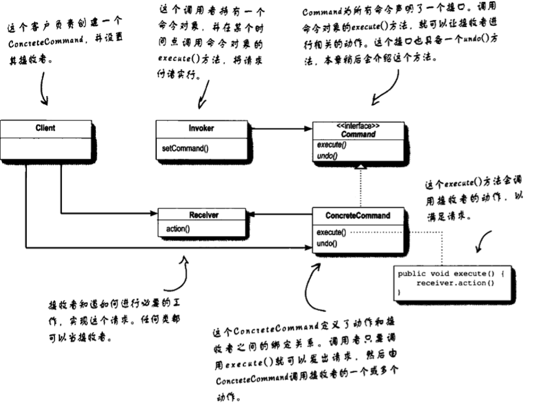
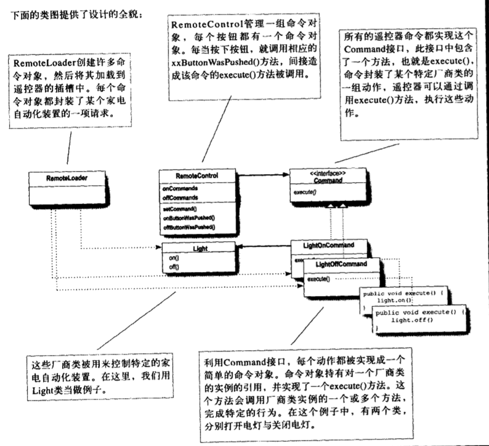
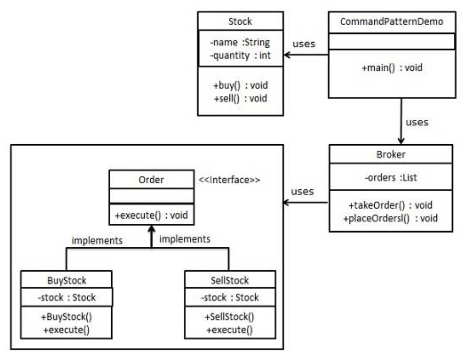

命令模式
---
1. 命令模式是一种数据驱动的设计模式。属于行为型模式。
2. 请求以命令的形式包裹在对象中并传给调用对象，并传给调用对象。
3. 调用对象寻找可以处理该命令的合适的对象，并把该命令传给相应的对象，该对象负责执行命令。

<!-- TOC -->

- [1. 命令模式引入](#1-命令模式引入)
- [2. 定义命令模式](#2-定义命令模式)
  - [2.1. 类图](#21-类图)
  - [2.2. 关键代码](#22-关键代码)
  - [2.3. 优点](#23-优点)
  - [2.4. 缺点](#24-缺点)
  - [2.5. 解决方案](#25-解决方案)
  - [2.6. 使用场景](#26-使用场景)
  - [2.7. 命令模式的一些问题](#27-命令模式的一些问题)
- [3. 具体实例](#3-具体实例)
  - [3.1. 遥控器问题](#31-遥控器问题)
    - [3.1.1. 实现简单的遥控器](#311-实现简单的遥控器)
    - [3.1.2. 放置空指针的对象来避免null引发的一些问题](#312-放置空指针的对象来避免null引发的一些问题)
  - [3.2. 命令模式的扩展:撤销问题的解决](#32-命令模式的扩展撤销问题的解决)
    - [3.2.1. 撤销问题的深入:使用状态来实现撤销](#321-撤销问题的深入使用状态来实现撤销)
  - [3.3. 宏命令](#33-宏命令)
    - [3.3.1. 宏命令的使用细节](#331-宏命令的使用细节)
    - [3.3.2. 撤销问题的解决](#332-撤销问题的解决)
  - [3.4. 队列请求](#34-队列请求)
  - [3.5. 日志请求](#35-日志请求)
    - [3.5.1. 问题解决](#351-问题解决)
    - [3.5.2. 新的问题:调用大型数据结构的问题](#352-新的问题调用大型数据结构的问题)
  - [3.6. 订单问题](#36-订单问题)
    - [3.6.1. 类图](#361-类图)
    - [3.6.2. 代码具体实现](#362-代码具体实现)

<!-- /TOC -->

# 1. 命令模式引入
1. 目的:将方法调用封装起来。
2. 结果:不关心实现，关心接口。
3. 总体来讲，命令模式可将"动作的请求者"从"动作的执行者"对象中解耦。
4. 命令对象:将每个按钮存储成一个命令对象，只要有个命令对象能和正确的对象沟通，把事情做好就行。

# 2. 定义命令模式
1. 定义:命令模式将"请求"封装成对象，以便使用不同的请求、队列或者日志来参数化其他对象。命令模式也支持可撤销的操作。
2. 仔细来看这个定义，我们知道一个命令对象通过在特定接收者上绑定一组活动来封装这个请求，要达到这一点，命令对象将动作和接受者包进对象中。接受者就会进行了哪些动作，只知道如果调用了execute()方法，请求的目的就能达到。
3. 使用命令模式来实现"队列、日志和支持撤销操作"
4. 可以持有Meta Command Pattern、Meta Command Pattern创建相应命令的宏，一遍一次执行多个命令。

## 2.1. 类图


## 2.2. 关键代码
1. received 真正的命令执行对象
2. Command
3. invoker 使用命令对象的入口

## 2.3. 优点
1. 降低了系统耦合度。
2. 新的命令可以很容易添加到系统中去。

## 2.4. 缺点
1. 使用命令模式可能会导致某些系统有过多的具体命令类。

## 2.5. 解决方案
1. 通过调用者调用接收者执行命令，顺序:调用者->接受者->命令。

## 2.6. 使用场景
1. 认为是命令的地方都可以使用命令模式，比如：
   1. GUI 中每一个按钮都是一条命令。
   2. 模拟 CMD。 

## 2.7. 命令模式的一些问题
1. 为什么不将一些操作在命令对象中实现，而是仅仅在execute()方法中实现呢？
    + 这样子也是可以的，我们设计出来的是聪明的命令对象，而如此的解耦程度比不上傻瓜的对象。
2. 我们如何实现多层次的撤销操作？
    + 使用栈数据类型。


# 3. 具体实例
## 3.1. 遥控器问题
1. 如何确保简单的遥控器只需要调用execute()方法即可执行正确的操作呢？
2. 因为每一个命令对象中的execute()都已经指定了一个receiver，所以不会错误的请求。

### 3.1.1. 实现简单的遥控器
1. 使用数组来记录每一个命令。
2. 同时在创建的时候，要创建一个NoCommand()来防止错误。
3. 使用StringBuffer来减少内存池的占用
4. 细节问题:如何避免每次都需要确认相应命令对象是否为空
    1. 我们只需要为每一个命令对象写一个空方法即可。
    2. 同时我们还在一开始将每个插槽都预先指定成NoCommand对象，保证每个插槽都有命令对象。

### 3.1.2. 放置空指针的对象来避免null引发的一些问题
1. NoCommand对象就是一个空对象(null object)的例子，意味着这时候，什么都不做就可。



## 3.2. 命令模式的扩展:撤销问题的解决
1. 在命令接口中写入undo()方法。
2. 但是新的问题出现了，这样子的操作我们只能撤销相应的一些指令，但是我们怎么用一个按钮来追踪最后被调用的命令呢？
    + 我们使用一个undoCommand的命令对象来记录上一个操作的命令究竟是什么
    + 当撤销指令被执行时，我们只需要调用相应的undo方法即可。
3. 同时我们在取得一个命令的同时，在优先执行它后记录下这个命令。

### 3.2.1. 撤销问题的深入:使用状态来实现撤销
1. 新的问题:如果一个命令对象出现了多个状态后那么如何来做这个撤销操作呢？
2. 具体参考：宏命令的使用

## 3.3. 宏命令
1. 每一个遥控器都应当具备"Party模式"
2. 有遥控器的时候，如果只能分别完成各个部分的工作，但是不能直接完成组合的活动，那么遥控器的作用受限，解决方案:使用宏命令

### 3.3.1. 宏命令的使用细节
1. 将一组指令存储下来，之后分别循环执行这个命令即可。
2. 第一步:想创建想要进入宏的命令集合。


3. 第二步:接下来创建两个数组，其中一个用来记录开启命令，另一个用来记录关闭命令，并在数组内放入对应的命令。


4. 第三步:然后将宏命令指定给我们所希望的按钮。
    + `remoteControl.setCommand(0,partyOnMacro,partyOffMarco)`
5. 第四步:最后只需要按下按钮，测试是否正常工作。

### 3.3.2. 撤销问题的解决
1. 目前的宏命令没有包含撤销功能，如果一个宏的命令被执行完，然后按下撤销按钮，那么宏内所进行的每一道命令都必须被撤销。
2. 问题解决:使用循环，针对每一个命令使用undo命令来逐一进行撤销。(反向进行清除)

## 3.4. 队列请求
1. 命令可以将运算块打包(一个接受者和一组动作)。
2. 命令对象在被创建后甚至可以在不同的线程中被调用，我们可以利用这个特性来衍生一些应用，例如:日程安排、线程池、工作队列等。
3. Web服务器应用这样的队列方式来保证工作队列类和进行计算的对象之间是完全解耦的。

## 3.5. 日志请求
1. 某些应用需要我们将所有的动作都记录在日志中，并能在系统死机之后，重新调用这些动作来恢复到之前的状态。

### 3.5.1. 问题解决
1. 新增store()、load()方法，使用命令模式支持这一点。
2. 那么为什么不用Java的序列化呢？
    + 一般我们认为序列化最好还是用在对象的持久化上。
3. 问题最终解决:系统死机->对历史记录中的命令的对象进行重新加载，并成批地依次调用这些对象的持久化上。

### 3.5.2. 新的问题:调用大型数据结构的问题
1. 我们通常是通过使用记录日志，我们可以将**上次检查点**之后的所有操作快速地存储下来。
2. 对于更高级的应用，这些技巧会被扩展应用到事物处理中，也就是说，一整群操作必须全部进行完成，或者没有进行任何的操作。

## 3.6. 订单问题
- 我们首先创建作为命令的接口 Order，然后创建作为请求的 Stock 类。实体命令类 BuyStock 和 SellStock，实现了 Order 接口，将执行实际的命令处理。创建作为调用对象的类 Broker，它接受订单并能下订单。
- Broker 对象使用命令模式，基于命令的类型确定哪个对象执行哪个命令。CommandPatternDemo，我们的演示类使用 Broker 类来演示命令模式。

### 3.6.1. 类图


### 3.6.2. 代码具体实现
1. 创建一个命令接口。
```java
public interface Order {
    void execute();
}
```
2. 创建一个请求类。
```java
public class Stock {
    private String name = "ABC";
    private int quantity = 10;
    public void buy(){
        System.out.println("Stock [ Name: "+name+", 
            Quantity: " + quantity +" ] bought");
    }
    public void sell(){
        System.out.println("Stock [ Name: "+name+", 
            Quantity: " + quantity +" ] sold");
    }
}
```
3. 创建实现了 Order 接口的实体类。
```java
public class BuyStock implements Order {
    private Stock abcStock;
    public BuyStock(Stock abcStock){
        this.abcStock = abcStock;
    }
    public void execute() {
        abcStock.buy();
    }
}
public class SellStock implements Order {
    private Stock abcStock;
    public SellStock(Stock abcStock){
        this.abcStock = abcStock;
    }
    public void execute() {
        abcStock.sell();
    }
}
```
4. 创建命令调用类。
```java
import java.util.ArrayList;
import java.util.List;
public class Broker {
    private List<Order> orderList = new ArrayList<Order>(); 
    public void takeOrder(Order order){
        orderList.add(order);      
    }
    public void placeOrders(){
        for (Order order : orderList) {
            order.execute();
        }
        orderList.clear();
    }
}
```
5. 使用 Broker 类来接受并执行命令。
```java
public class CommandPatternDemo {
    public static void main(String[] args) {
        Stock abcStock = new Stock();
    
        BuyStock buyStockOrder = new BuyStock(abcStock);
        SellStock sellStockOrder = new SellStock(abcStock);
    
        Broker broker = new Broker();
        broker.takeOrder(buyStockOrder);
        broker.takeOrder(sellStockOrder);
    
        broker.placeOrders();
    }
}
```