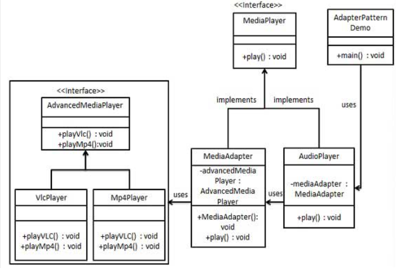

适配器模式
---

<!-- TOC -->

- [1. 适配器模式引入](#1-适配器模式引入)
  - [1.1. 为什么使用适配器](#11-为什么使用适配器)
  - [1.2. 什么是适配器](#12-什么是适配器)
  - [1.3. 适配器的例子](#13-适配器的例子)
  - [1.4. 我们如何使用适配器](#14-我们如何使用适配器)
  - [1.5. 关于适配器的问题](#15-关于适配器的问题)
- [2. 适配器模式](#2-适配器模式)
  - [2.1. 定义](#21-定义)
  - [2.2. 优缺点](#22-优缺点)
    - [2.2.1. 优点](#221-优点)
    - [2.2.2. 缺点](#222-缺点)
  - [2.3. 适配器分类](#23-适配器分类)
    - [2.3.1. 对象适配器](#231-对象适配器)
    - [2.3.2. 类的适配器](#232-类的适配器)
  - [2.4. 适配器实例](#24-适配器实例)
    - [2.4.1. 真实世界中的适配器的例子](#241-真实世界中的适配器的例子)
    - [2.4.2. 旧世界的适配器](#242-旧世界的适配器)
    - [2.4.3. 新世界的适配器](#243-新世界的适配器)
      - [2.4.3.1. 出现的问题产生及解决](#2431-出现的问题产生及解决)
      - [2.4.3.2. 设计适配器](#2432-设计适配器)
  - [2.5. 适配器模式的使用场景](#25-适配器模式的使用场景)
- [3. 适配器模式的实现](#3-适配器模式的实现)
  - [3.1. 类图](#31-类图)
  - [3.2. 代码实现](#32-代码实现)
- [4. 装饰者模式和适配者模式的差异](#4-装饰者模式和适配者模式的差异)

<!-- /TOC -->

# 1. 适配器模式引入
1. 以不同的目的，包装某些对象:让他们的接口看起来不像自己而像别的东西。

## 1.1. 为什么使用适配器
- 因为这样就可以在类的设计中，将类的接口转换成想要的接口，以便实现不同的接口。

## 1.2. 什么是适配器
1. 适配器改变了插座的接口，让其更加符合相应的需求。
2. 如果你不想要改变现有的代码，那么你在两个不兼容的系统之间，需要的是适配器。


## 1.3. 适配器的例子
1. 假设你缺少鸭子对象，并且想要用一些火鸡对象来冒充，那么你需要写一个适配器:


## 1.4. 我们如何使用适配器
1. 客户使用适配器的过程如下:
    1. 客户通过目标接口调用适配器的方法对适配器发出请求。
    2. 适配器使用被适配者接口把请求转换成适配者的一个或多个调用接口。(translatedRequest)
    3. 客户接受到调用的结果，但并未察觉这一切是适配器在起换作用。
2. 那么我们可以看出来在上述过程中，客户和适配者是解耦的，彼此互相不知道。

## 1.5. 关于适配器的问题
1. 适配器的大小
    + 从总体上来讲适配器的大小从整体上来讲和目标接口的大小成正比。
2. 一个适配器只能够封装一个类吗？
    + 虽然大多数的适配器模式都只能包装一个被适配者。但是在一些情况下，我们需要让一个适配器的包装类来适配多个被适配者。
3. 如果我的系统中新旧并存，在接口进行更新后的适配器不能进行修改？
    + 我们可以创建一个双向的适配器，同时支持两边的接口，这样可以同时被用作新的接口和旧的接口。

# 2. 适配器模式
1. 适配器模式是作为两个不兼容的接口之间的桥梁。属于结构型模式。
2. 这种模式涉及到一个单一的类，该类负责加入独立的或不兼容的接口功能。

## 2.1. 定义
1. 将一个类的接口转换成客户希望的另外一个接口。适配器模式使得原本由于接口不兼容而不能一起工作的那些类可以一起工作。
2. 解决问题:主要解决在软件系统中，需要将一些"现存的对象"放到新的环境中，而新环境要求的接口是现对象不能满足的。
3. 代码解决方案:继承或依赖(推荐)。
4. 注意问题:适配器不是在详细设计时添加的，而解决正在服役的项目的问题。

## 2.2. 优缺点

### 2.2.1. 优点
1. 可以让任何两个没有关联的类一起运行。
2. 提高了类的复用。
3. 增加了类的透明度。
4. 灵活性好。 

### 2.2.2. 缺点
1. 过多地使用适配器，会让系统非常零乱，不易整体进行把握。比如，明明看到调用的是 A 接口，其实内部被适配成了 B 接口的实现，一个系统如果太多出现这种情况，无异于一场灾难。因此如果不是很有必要，可以不使用适配器，而是直接对系统进行重构。
2. 由于 JAVA 至多继承一个类，所以至多只能适配一个适配者类，而且目标类必须是抽象类。 

## 2.3. 适配器分类

### 2.3.1. 对象适配器
1. 类图


2. 特点:
    1. 使用组合，可以适配某个类，包括其子类。

### 2.3.2. 类的适配器
1. 类图


2. 问题:在java中不支持多重继承，所以不支持这样子的适配器。
3. 特点:
    1. 因为是继承，所以其在必要的时候可以覆盖被适配者的行为。
    2. 效率高，无需被适配者和一个适配器。

## 2.4. 适配器实例

### 2.4.1. 真实世界中的适配器的例子
1. 电脑不能直接读取相机的内存卡，而需要读卡器来作为适配器

### 2.4.2. 旧世界的适配器
1. 集合(collection)类型中的elements()的方法，该方法返回一个Enumeration(举)。这个集合可以逐一走过集合中的每个元素，而无需知道它们在集合内是如何被管理的。


### 2.4.3. 新世界的适配器
1. 在Sun推出新的集合类的时候，开始使用了Iterator(迭代器)接口.


#### 2.4.3.1. 出现的问题产生及解决
1. 那么问题来了，我们面对遗留代码，这些代码暴露出枚举器的接口，但我又希望在新的代码中只是用迭代器。
2. 所以我们一般是使用适配器模式来解决这个问题。

#### 2.4.3.2. 设计适配器


1. 那么问题来了:没有remove()这个方法的对应怎么办呢？
2. 首先类图如下


3. 解决这个问题:我们最终选择抛出一个运行时异常，抛出UnsupportedOperationException。
    + `throw new UnsupportedOperationException();`

## 2.5. 适配器模式的使用场景
1. 系统需要使用现有的类，而此类的接口不符合系统的需要。
2. 想要建立一个可以重复使用的类，用于与一些彼此之间没有太大关联的一些类，包括一些可能在将来引进的类一起工作，这些源类不一定有一致的接口。
3. 通过接口转换，将一个类插入另一个类系中。(比如老虎和飞禽，现在多了一个飞虎，在不增加实体的需求下，增加一个适配器，在里面包容一个虎对象，实现飞的接口。) 
4. 虚拟机(Windows机器上运行LInux)

# 3. 适配器模式的实现
1. 我们有一个 `MediaPlayer` 接口和一个实现了 `MediaPlayer` 接口的实体类 `AudioPlayer`。默认情况下，`AudioPlayer` 可以播放 mp3 格式的音频文件。
2. 我们还有另一个接口 `AdvancedMediaPlayer` 和实现了 `AdvancedMediaPlayer` 接口的实体类。该类可以播放 vlc 和 mp4 格式的文件。
3. 我们想要让 `AudioPlayer` 播放其他格式的音频文件。为了实现这个功能，我们需要创建一个实现了 `MediaPlayer` 接口的适配器类 `MediaAdapter`，并使用 `AdvancedMediaPlayer` 对象来播放所需的格式。
4. `AudioPlayer` 使用适配器类 `MediaAdapter` 传递所需的音频类型，不需要知道能播放所需格式音频的实际类。AdapterPatternDemo，我们的演示类使用 AudioPlayer 类来播放各种格式。

## 3.1. 类图


## 3.2. 代码实现
1. 为媒体播放器和更高级的媒体播放器创建接口。
```java
public interface MediaPlayer {
    public void play(String audioType, String fileName);
}
public interface AdvancedMediaPlayer { 
    public void playVlc(String fileName);
    public void playMp4(String fileName);
}
```
2. 创建实现了 AdvancedMediaPlayer 接口的实体类。
```java
public class VlcPlayer implements AdvancedMediaPlayer{
    @Override
    public void playVlc(String fileName) {
        System.out.println("Playing vlc file. Name: "+ fileName);      
    }
    
    @Override
    public void playMp4(String fileName) {
        //什么也不做
    }
}
public class Mp4Player implements AdvancedMediaPlayer{
    @Override
    public void playVlc(String fileName) {
        //什么也不做
    }
    @Override
    public void playMp4(String fileName) {
        System.out.println("Playing mp4 file. Name: "+ fileName);      
    }
}
```
3. 创建实现了 MediaPlayer 接口的适配器类。
```java
public class MediaAdapter implements MediaPlayer {
    AdvancedMediaPlayer advancedMusicPlayer;
    public MediaAdapter(String audioType){
        if(audioType.equalsIgnoreCase("vlc") ){
            advancedMusicPlayer = new VlcPlayer();       
        } else if (audioType.equalsIgnoreCase("mp4")){
            advancedMusicPlayer = new Mp4Player();
        }  
    }
    @Override
    public void play(String audioType, String fileName) {
        if(audioType.equalsIgnoreCase("vlc")){
            advancedMusicPlayer.playVlc(fileName);
        }else if(audioType.equalsIgnoreCase("mp4")){
            advancedMusicPlayer.playMp4(fileName);
        }
    }
}
```
4. 创建实现了 MediaPlayer 接口的实体类。
```java
public class AudioPlayer implements MediaPlayer {
    MediaAdapter mediaAdapter; 
    @Override
    public void play(String audioType, String fileName) {    
        //播放 mp3 音乐文件的内置支持
        if(audioType.equalsIgnoreCase("mp3")){
            System.out.println("Playing mp3 file. Name: "+ fileName);         
        }
        //mediaAdapter 提供了播放其他文件格式的支持
        else if(audioType.equalsIgnoreCase("vlc") 
            || audioType.equalsIgnoreCase("mp4")){
            mediaAdapter = new MediaAdapter(audioType);
            mediaAdapter.play(audioType, fileName);
        }
        else{
            System.out.println("Invalid media. "+
                audioType + " format not supported");
        }
    }   
}
```
5. 使用 AudioPlayer 来播放不同类型的音频格式。
```java
public class AdapterPatternDemo {
    public static void main(String[] args) {
        AudioPlayer audioPlayer = new AudioPlayer();
    
        audioPlayer.play("mp3", "beyond the horizon.mp3");
        audioPlayer.play("mp4", "alone.mp4");
        audioPlayer.play("vlc", "far far away.vlc");
        audioPlayer.play("avi", "mind me.avi");
    }
}
```

# 4. 装饰者模式和适配者模式的差异
1. 装饰者模式:我们可以让相应新的责任和义务加入我们。
2. 适配者模式:我们允许客户使用新的库和子集合，无需改变代码。
